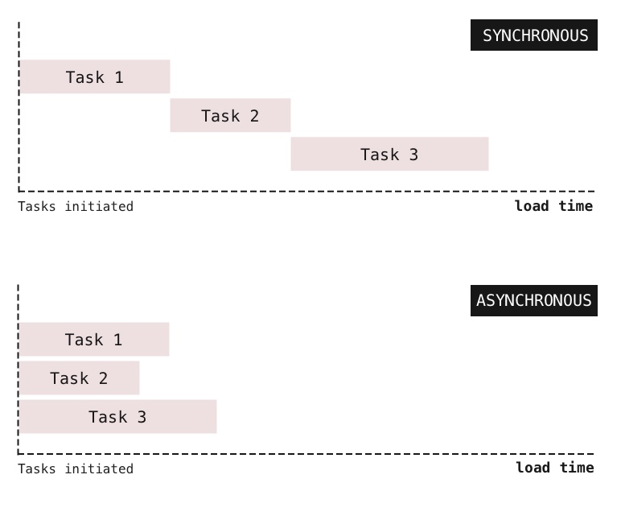
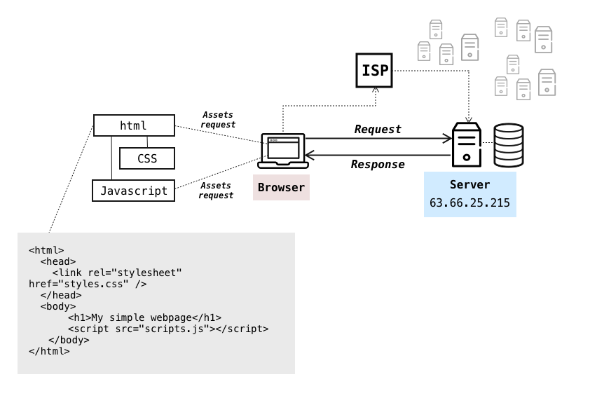

# JavaScript Core II - 3

**What we will learn today?**

In this lesson you will learn about Synchronous and Asynchronous programming and what is a callback, complex concepts that write code is needed to understand them.
Also, you will understand the architecture client/server, what HTTP works and how to use fetch.

**Before the class**

> Please before start the class fork and clone [exercises-js2-week3 repo](https://github.com/Migracode-Barcelona/exercises-js2-week3)

## Index

- [Synchronous and Asynchronous programming](#synchronous-and-asynchronous-programming)
  - [A real life example](#a-real-life-example)
  - [A Javascript example](#javascript-examples)
  - [Callbacks](#callbacks)
- [How does the web work?](#how-does-the-web-work)
  - [Client/Server architecture](#clientserver-architecture)
  - [HTTP Requests](#http-requests)
  - [Fetch](#fetch)

---

## Synchronous and Asynchronous programming

In a synchronous programming model, tasks run one at a time. When a long running action starts, the program waits for it to finish and return the result before it moves to the next action.

Asynchronous programming allows multiple actions to happen at the same time. When a long running action starts, the program can continue to run. When the action finishes the program will get notified and get access to the result returned.



### A real life example

An example of this in real life, are phone calls and text messages.

- Phone calls are `synchronous` because you can't (really) do anything while the
  other person is speaking. You are always waiting for your turn to respond
- Text messages are `asynchronous`. When you send a text, you can go away and do
  something else, until the other person responds.

### Javascript examples

Can you analyze in what order these messages will be printed?

```js
//synchronous
console.log("First action");
console.log("Second action");
console.log("Third action");
```

```js
//asynchronous
console.log("First action");
setTimeout(function () {
  console.log("Second action");
}, 1000);
console.log("Third action");
```

And now?

```js
//functions
function first(){
  console.log("First action");
  setTimeout(firstWithTimeout, 2000);
}
function firstWithTimeout(){
  console.log("First action with timeout");
}

function second(){
  console.log("Second action");
  setTimeout(secondWithTimeout, 1000);
}

function secondWithTimeout(){
  console.log("Second action with timeout");
}

function third(){
  console.log("Third action");
}

//main
first();
second();
third();
```

As you can observe, functions in Javascript are asynchronous, the main code continues without waiting the function is finished.
In some other programming languages, functions by default are synchronous.

#### Exercise

From [exercises-js2-week3 repo](https://github.com/Migracode-Barcelona/exercises-js2-week3) in folder **InClass/A-timeout** do exercise.js

### Callbacks

We have already seen callback functions - in the Array methods `forEach`, `map`, `filter` etc. They are functions that are passed as parameter to another function.

In order to achieve asynchronicity, callbacks can be passed on functions that perform a slow action. By doing so, the callback function can be called with the result.
This allows you to run some other code while you're waiting for something to finish.

```js
function finished() {
  console.log("The task has finished");
}

function thingThatTakesALongTime(callbackFunction) {
  //... Task that takes a long time to complete

  callbackFunction(); // This is where the 'console.log' happens
}

// Pass the function to 'thingThatTakesALongTime' just like a normal variable
thingThatTakesALongTime(finished);
```

A simple example of an asynchronous function is `setTimeout`. This allows you to run a function after a given time period. The first argument is the function you want to run, the second argument is the `delay` (in milliseconds)

```js
// Separate function definition
function myCallbackFunction() {
  console.log("Hello world!");
}
setTimeout(myCallbackFunction, 1000);

// Inline function
setTimeout(function () {
  console.log("Hello world!");
}, 500);
```

Now let's use a timeout and a callback function together:

```js
function mainFunction(callback) {
  console.log("Starting!");
  setTimeout(function () {
    callback();
  }, 1000);
  console.log("Continuing!");
}
function myCallbackFunction() {
  console.log("Finished!");
}
mainFunction(myCallbackFunction);
```

#### Exercise

From [exercises-js2-week3 repo](https://github.com/Migracode-Barcelona/exercises-js2-week3) in folder **InClass/B-movies** do exercise.js


## How does the web work?

### Client/Server architecture


A **Client** is the typical web user's internet-connected devices and apps. This can be a web browser, a Slack app, your phone, etc.

A **Server** is a computer or program that manages access to resources such as webpages, sites, or apps.

There are database servers, mail servers, game servers, etc. The vast majority of these servers are accessed over the internet. They can take the form of industrial server farms that provide a service to millions of users (used by Facebook, Google, etc.), to personal servers for storing your files.

The **server** communicates with **clients**.

Client–server systems use the **request–response** model: a client sends a request to the server, which performs some action and sends a response back to the client, typically with a result or acknowledgement.



### HTTP Requests

A server stores the data, and the client (other programs or computers) requests data or sends some of its own. But how do they talk to each other?

**For the client and the server to communicate they need an established language (a protocol)**. Which is what HTTP (Hypertext Transfer Protocol) is for. It defines the methods you can use to communicate with a server and indicate your desired actions on the resources of the server.

There are two main types of requests: **GET** and **POST**.

| Request type |                      Description                       |
| ------------ | :----------------------------------------------------: |
| GET          | Ask for a specified resource (e.g. show me that photo) |
| POST         |     Send content to the server (e.g. post a photo)     |

HTTP is the language of the internet. In our case we're using Javascript, but you can send HTTP requests with other laguages as well.

### Fetch

The interface through which browser JavaScript can make HTTP requests is called fetch. By default, fetch uses GET method.
Calling fetch returns a promise that resolves to a Response object holding information about the server’s response, such as its status code and its headers.
The first argument to fetch is the URL that should be requested. When that URL doesn’t start with a protocol name (such as http:). When it starts with a slash (/), it replaces the current path, which is the part after the server name.

The following code go to an API endpoint and get an object with weather information, as temperature and humidity.
Execute the URL directly in the browser to see the structure and information of the result object

```js
fetch('https://fcc-weather-api.glitch.me/api/current?lat=35&lon=160')
  .then(function(response) {
    console.log(response.status);
    return response.json();
  })
  .then(function(myJson) {
    //console.log(myJson);
    console.log(myJson.main.temp);
  });
```

Get more information about fetch in [Developer Mozilla: Using fetch](https://developer.mozilla.org/en-US/docs/Web/API/Fetch_API/Using_Fetch)

#### Exercise

From [exercises-js2-week3 repo](https://github.com/Migracode-Barcelona/exercises-js2-week3) in folder **InClass/C-fetch** do exercise.js


