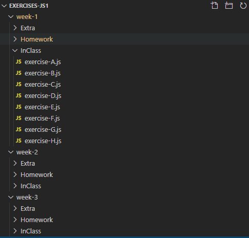

# Mentors Guide

# Index

- [General information](#general-information)
  - [Module Structure](../html-css/week-1/mentors.md) 
  - [Exercises](../html-css/week-2/mentors.md) 
  - [Example of a lesson structure](../html-css/week-3/mentors.md)
  - [Prepare a class (main instructors)]
  - ## Tools that we use
  - ## Know your students
- [Classes Notes for Mentors](#classes-notes-for-mentors)
- [Feedback & Contributing](#feedback-&-contributing)
- [Other links](#other-links)

# General information

## Module Structure

Each module has 3 weeks lessons, and each lesson is divided as follows:
  - Weekday (4h): explain topics through materials syllabus and presentations and coding, in every topic there are one or more exercises that you would give time to the students to do it, later you can show how to solve it
  - Homework (20h): exercises students should complete between the Weekday and the Weekend to practice the new content. As a instructor you don't have to do anything, the Migracode's Education Team will help and push the students to have all exercises finished before the Weekend.
  - Weekend (4h): is a day to practice, at the beginning we would do a recap and check together the homework, after it and with support, they have to do the exercises by their own. The instructor can stop the class to explain a common doubt or solve exercises together. But it is important to let them think and cope the exercises, to not always just copy what the mentor is writing.

## Exercises

the exercises studedents should complete during the class, as homework and on saturday, are all inside a GitHub repository that they fork and clone every module. The structure is as follows:

- For each week of the module we have a folder with the week number week-1
- Inside each week folder, we can find 3 folders:
    - InClass: exercises they should complete during the class
    - Homework: exercises they should complete after the class and before Saturday
    - Extra: optional exercises students can complete
- See an example [here](https://github.com/Migracode-Barcelona/exercises-js1)

- [Online classes manual](https://docs.google.com/document/d/13KBKYSfzPxzGtEE5HM15M6vUOjSz71wgYNfx0SOGQQE/edit)

- The lesson structure for each week is:

## Example of a lesson structure

---

### [Class name]

** What we will learn today?**

* Topic 1
* Topic 2
* Topic 3

#### Topic 1

High level explanation of Topic 1 - rely on the exercises

> **Exercise A (10 min)**: Always have exercises

#### Topic 2

> **Exercise B (10 min)**: Always have exercises

#### Topic 3

> **Exercise C (10 min)**: Always have exercises

### Resources

1. [Resource 1 to learn more about Topic 1](https://google.com)
2. [Resource 2 for Topic 2](https://google.com)

### Homework

1. From the Javascript/Core Module 1 repository review and finish all exercises in the folder week-1/InClass
2. Complete all of the exercises in the folder week-1/Homework
3. Push the changes to your repository in Github
4. Complete the Homework Form, to notify mentors and add comments and questions about the exercises

### Practice Day (Saturday)

1. Check together, solve doubts and fix the Homework exercises
2. Go to CodeWars and solve as many katas as you can:
3. [Optional] Complete the exercises in the folder week-2/Extra
4. Push the changes to your repository in Github

### Escalation Policy



---

## Prepare a class (main instructors)

Before starting, please read the following general guidelines and Checklist for a lesson.
Prepare the lesson: Start by drafting the Class outline, define the High level topics and their order, then follow this checklist to expand the Lesson's materials.

## Tools that we use

As a mentor you can use the O.S. that you have, or you can use other tools not listed taking into account to not confuse students

- Ubuntu: most students have Ubuntu, but there are some students with Mac or Windows
- Visual Code: is the IDE we use for all the languages during the course
- Git: all the students have a GitHub account and push their exercises always using the Terminal
- Node: is the tool we use to execute by command line scripts without UI
- NPM: to install modules and to execute Web Servers
- Chrome: Browser we normally use, and we teach how to use the inspector
- PostreSQL
- DBeaver: as an SQL client with UI

## Know your students

To see the students progress ask for access in the files

- [Students Progress](https://docs.google.com/spreadsheets/d/1TKd_X-bsx1qbInkAv7x5d3slkJF9sEExfCnFRyjllBk)

# Classes Notes for Mentors

- [Week 0 - Introduction and basic setup](mentors-notes.html#week-0-introduction-and-basic-setup)
- [HTML/CSS](mentors-notes.html#html/css)
  - [Week 1 - Semantic HTML and CSS](mentors-notes.html#week-1-semantic-html-and-css) 
  - [Week 2 - Responsive Web and layout](mentors-notes.html#week-2-responsive-web-and-layout) 
  - [Week 3 - Bootstrap](mentors-notes.html#week-3-bootstrap)
- [Javascript/Core I](mentors-notes.html#javascript/core-I)
  - [Week 1 - Hello Javascript](mentors-notes.html#week-1-hello-javascript)
  - [Week 2 - Expressions and Loops](mentors-notes.html#week-2-expressions-and-loops)
  - [Week 3 - More arrays](mentors-notes.html#week-3-more-arrays)
- [Javascript/Core II](mentors-notes.html#javascript/core-II)
  - [Week 1 - Objects](mentors-notes.html#week-1-objects)
  - [Week 2 - JS in the Browser](mentors-notes.html#week-2-js-in-the-browser)
  - [Week 3 - More JS in the Browser](mentors-notes.html#week-3-more-js-in-the-browser)

# Feedback & Contributing

Under construction: for now any feedback or contribution is completely welcome, just email to carlos@migracode.org or send a Slack message
There are discussions about each module and every class in a module, make sure to go through them (or add a new issue/discussion point).

# Other links

- [Code of conduct](CODE_OF_CONDUCT.md)
- [Git Contributing](CONTRIBUTING.md)
